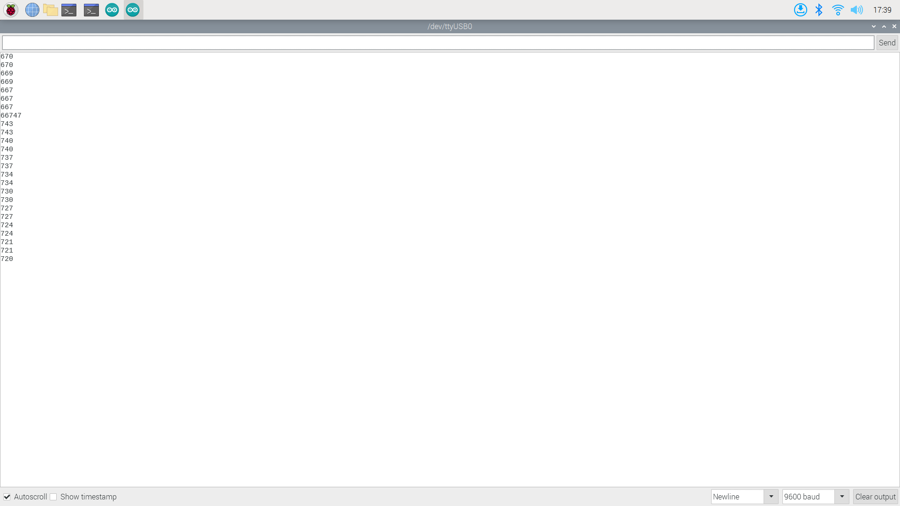
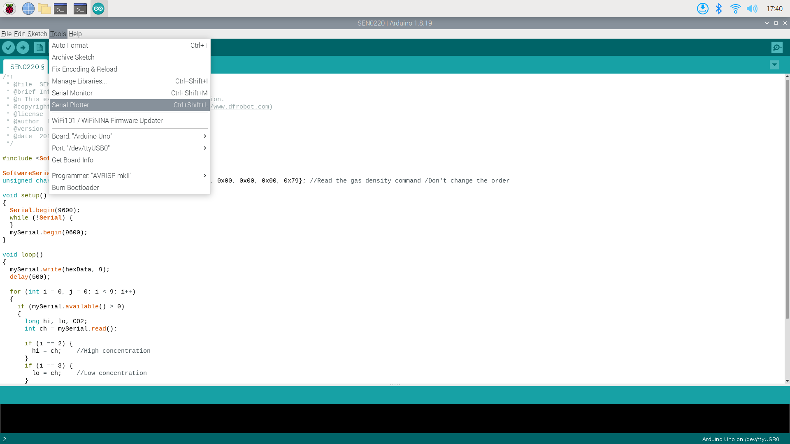

## CO2센서 소개
- 가스가 흡수하는 적외선 양으로 측정합니다. 
- 특정 가스 농도를 구체적으로 구분해서 측정합니다.
- 주변의 산소농도나 온도에 영향을 받지않습니다.
- 유효범위가 0~50000pm으로 광범위합니다. 
(기존의 센서는 400~5000pm) 


---

# 구성품확인 
1. 라즈베리파이 4 
2. 아두이노 
3. 아두이노케이블 
4. CO2 센서 


---

## 회로도 


###### 참고: 이미 연결된 상태이므로 센서가 아두이노의 10과 11번 핀에 연결된다는 것만 확인하면 됩니다. 

---

## 아두이노 코드 
```c 
#include <SoftwareSerial.h>

SoftwareSerial mySerial(10, 11); // RX, TX
unsigned char hexData[9] = {0xFF, 0x01, 0x86, 0x00, 0x00, 0x00, 0x00, 0x00, 0x79}; //Read the gas density command /Don't change the order

void setup()
{
  Serial.begin(9600);
  while (!Serial) {
  }
  mySerial.begin(9600);
}

void loop()
{
  mySerial.write(hexData, 9);
  delay(500);

  for (int i = 0, j = 0; i < 9; i++)
  {
    if (mySerial.available() > 0)
    {
      long hi, lo, CO2;
      int ch = mySerial.read();

      if (i == 2) {
        hi = ch;    //High concentration
      }
      if (i == 3) {
        lo = ch;    //Low concentration
      }
      if (i == 8) {
        CO2 = hi * 256 + lo; //CO2 concentration
        //Serial.print("CO2 concentration: ");
        //Serial.print(CO2);
        Serial.println(CO2);
        //Serial.println("ppm");
      }
    }
  }
}
```
###### 아두이노의 시리얼 모니터로 0.5초 간격으로 CO2의 ppm 농도를 출력합니다.
---
# 실행하기

---
# 라즈베리파이 실행하기 

###### 전에 보내드렸던 마우스와 모니터를 연결한후에 전원케이블을 연결합니다.

---

# 아두이노 실행하기

###### 라즈베리파이 바탕화면에 있는 아두이노를 실행합니다. (아두이노 코드는 이미 들어있기 때문에 별도로 컴파일 업로드를 안해도됩니다. ) 


---
# 측정하기

---

# 시리얼 모니터로 데이터 확인하기 

###### 아두이노의 우측 상단에 돋보기 모양 아이콘을 누르면 데이터가 출력되는 것을 확인할 수 있습니다. 

---

# 시리얼 플로터 실행하는 법

###### Tools에서 Serial Plotter를 실행합니다.

---

# 시리얼 플로터 데이터 확인하기

###### 시리얼 플로터로 데이터의 추이를 그래프로 확인할 수 있습니다. 

--- 

# 참고사항 
1. 초반 3분 결과는 예열시간에 나오는 데이터이므로 무시해도됩니다.
2. 센서가 필터링 알고리즘을 내부에서 실행하므로 평균값을 출력합니다.  

---


# 감사합니다.
